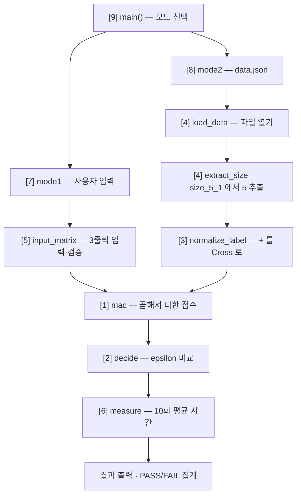
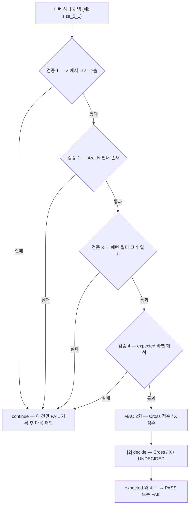
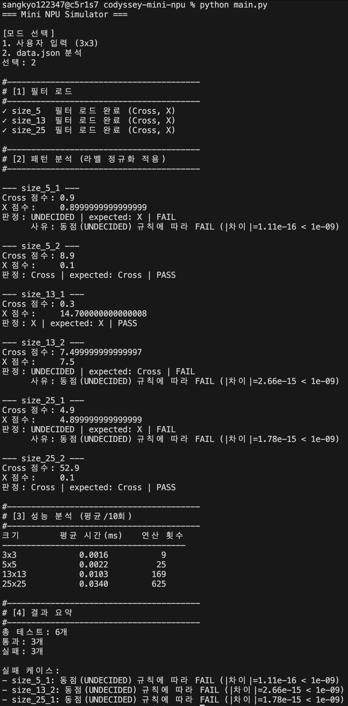
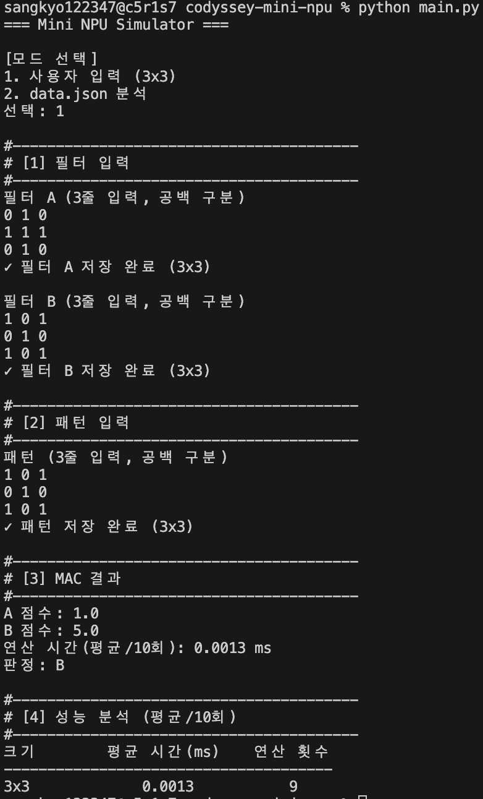
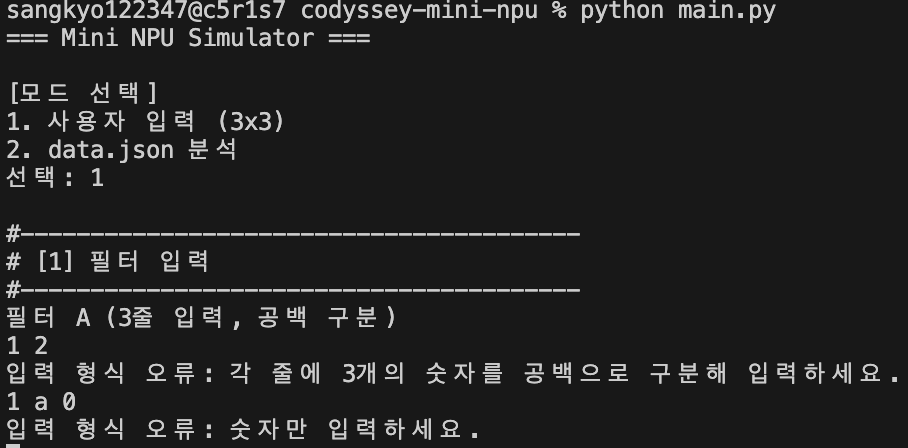

# Mission 3 — Mini NPU Simulator

AI 연산의 기본인 MAC(Multiply-Accumulate, 곱셈-누산)을 파이썬 표준 라이브러리만으로 구현한 콘솔 프로그램이다.
입력된 숫자 패턴이 Cross(십자가) 필터와 X 필터 중 어느 쪽에 더 가까운지를 점수로 판정한다.

- 개발 환경: Python 3.8 이상
- 외부 라이브러리 사용 없음 (표준 라이브러리 `json`, `time`만 사용)

---

## 1. 실행 방법

```bash
python3 main.py
```

실행하면 모드를 묻는다. `data.json`은 `main.py`와 같은 폴더에 있어야 한다.

| 선택 | 모드 | 동작 |
|---|---|---|
| `1` | 사용자 입력 (3×3) | 필터 A·B와 패턴을 한 줄씩 입력 → 점수 / 연산 시간 / 판정 출력 |
| `2` | data.json 분석 | 필터 로드 → 케이스별 PASS·FAIL → 성능 분석 → 결과 요약 |

### 모드 1 입력 예시

```
선택: 1
필터 A (3줄 입력, 공백 구분)
0 1 0
1 1 1
0 1 0
필터 B (3줄 입력, 공백 구분)
1 0 1
0 1 0
1 0 1
패턴 (3줄 입력, 공백 구분)
1 0 1
0 1 0
1 0 1

→ A 점수: 1.0 / B 점수: 5.0 / 연산 시간(평균/10회): 0.0016 ms / 판정: B
```

행·열 개수가 틀리거나(`1 2`) 숫자가 아닌 값(`1 a 0`)을 입력하면 안내 문구를 출력하고
**해당 줄부터 다시 입력**받는다. 프로그램은 종료되지 않는다.

---

## 2. 프로그램 구조

`main.py` 한 파일 안에서 역할별로 구역을 나눴다. 주석의 대괄호 번호가 구역 번호다.

| 구역 | 이름 | 역할 |
|---|---|---|
| `[0]` | 설정값 | `EPSILON = 1e-9`, `REPEAT = 10` |
| `[1]` | `mac()` | 위치별 곱셈 → 누적 합산 → 점수 반환 |
| `[2]` | `decide()` | 두 점수를 epsilon 기준으로 비교해 판정 |
| `[3]` | `normalize_label()` | `+`, `cross`, `x` → 표준 라벨 `Cross` / `X` |
| `[4]` | `load_data()`, `extract_size()` | JSON 로드, 키에서 크기 N 추출 |
| `[5]` | `input_matrix()` | 모드 1 입력 및 검증 |
| `[6]` | `measure()` | MAC 연산 구간만 10회 반복 측정 |
| `[7]` | `mode1()` | 사용자 입력 모드 |
| `[8]` | `mode2()` | data.json 분석 모드 |
| `[9]` | `main()` | 모드 선택 라우팅 |

### 전체 흐름



### 모드 2의 케이스 처리 순서



어느 검증 단계에서 실패해도 **해당 케이스만 FAIL로 기록하고 다음 패턴으로 넘어간다.**
프로그램 전체가 중단되지 않는다.

---

## 3. 구현 요약

### MAC 연산

```python
def mac(pattern, filter_data):
    score = 0.0
    for row in range(len(pattern)):
        for col in range(len(pattern[row])):
            score += pattern[row][col] * filter_data[row][col]
    return score
```

- 바깥 `for`는 행(세로), 안쪽 `for`는 열(가로)을 순회한다.
- `*`가 Multiply, `+=`가 Accumulate — 이 한 줄이 MAC 그 자체다.
- 크기를 `3`으로 고정하지 않고 `len()`으로 세기 때문에 3×3부터 25×25까지 같은 함수를 재사용한다.
  모드 2에서 이 함수를 한 글자도 고치지 않고 그대로 사용했다.

### 라벨 정규화

`data.json`은 같은 개념을 서로 다르게 표기한다. 필터 키는 `"cross"` / `"x"`이고,
패턴의 `expected` 값은 `"+"` / `"x"`다. 이를 그대로 비교하면 `"cross"`와 `"+"`가 다른 값으로
취급되어 모든 케이스가 FAIL이 된다.

| 외부 표기 | 출처 | 표준 라벨 |
|---|---|---|
| `cross` | filters 키 | `Cross` |
| `+` | expected 값 | `Cross` |
| `x` | filters 키 / expected 값 | `X` |

정규화를 `normalize_label()` 함수 하나로 분리한 이유는, 새 표기(예: `plus`, `o`)가 추가돼도
**이 함수 한 곳만 수정하면 되기 때문**이다. 콘솔 출력과 PASS/FAIL 비교는 모두 표준 라벨 기준이다.

### 점수 비교 정책 (epsilon)

```python
EPSILON = 1e-9
if abs(score_a - score_b) < EPSILON:   # 동점 → UNDECIDED
```

부동소수점은 `0.1`을 2진수로 정확히 표현하지 못한다. 그래서 같은 값을 더해도 **더하는 순서에 따라**
최하위 자리가 미세하게 달라진다. `>` 만으로 비교하면 이 오차가 승부를 결정해버리므로,
차이가 `1e-9` 미만이면 동점으로 선언한다.

동점 처리는 두 모드에서 **판정 로직은 같고 출력·집계 방식만 다르다.**
모드 1은 정답(expected)이 없는 대화형 모드라 `판정 불가`를 안내하고 끝낸다.
모드 2는 채점 모드이고, `UNDECIDED`는 `Cross`도 `X`도 아니므로 expected와 절대 같을 수 없어
**항상 FAIL로 집계된다.**

### 시간 측정 경계

```python
start = time.perf_counter()
mac(pattern, filter_data)
end = time.perf_counter()
```

`input()`이나 파일 읽기는 사람의 입력 속도·디스크 속도에 좌우되므로 연산 시간이 아니다.
따라서 스톱워치의 시작과 끝을 **`mac()` 호출 직전과 직후**로 잡아 I/O를 완전히 배제했다.

### 새 라벨 확장 절차

`o`(원)처럼 새 라벨이 추가될 경우, 아래 순서대로 확장한다.
정규화를 함수로 분리해 두었기 때문에 1단계가 한 줄로 끝난다.

| 순서 | 단계 | 수정 위치 | 확인할 것 |
|---|---|---|---|
| 1 | **정규화** | `[3] normalize_label()` | `"o"` → `"Circle"` 매핑 한 줄 추가 |
| 2 | **판정** | `[2] decide()` | 두 점수 비교를 3개 이상의 최댓값 비교로 확장. 1등과 2등의 차이가 EPSILON 미만이면 UNDECIDED |
| 3 | **출력** | `[8] mode2()` | "Cross 점수 / X 점수" 고정 출력을 라벨별 반복 출력으로 변경 |
| 4 | **테스트** | `data.json` | `size_N`에 해당 라벨 필터가 있는지 검증하고, `expected`가 `o`인 케이스를 추가해 PASS/FAIL 확인 |

이 순서를 지키는 이유는 앞 단계가 뒤 단계의 전제이기 때문이다.
정규화가 되지 않으면 판정 함수가 라벨을 인식하지 못하고,
판정이 확장되지 않으면 출력에 표시할 결과가 없으며,
출력까지 마쳐야 테스트로 검증할 수 있다.

---

## 4. 결과 리포트

### 4-1. 실행 결과 (모드 2, 제공된 data.json)

```
총 테스트: 6개
통과: 3개
실패: 3개

실패 케이스:
- size_5_1 : 동점(UNDECIDED) 규칙에 따라 FAIL (|차이|=1.11e-16 < 1e-09)
- size_13_2: 동점(UNDECIDED) 규칙에 따라 FAIL (|차이|=2.66e-15 < 1e-09)
- size_25_1: 동점(UNDECIDED) 규칙에 따라 FAIL (|차이|=1.78e-15 < 1e-09)
```

| 케이스 | Cross 점수 | X 점수 | 판정 | expected | 결과 |
|---|---|---|---|---|---|
| size_5_1 | 0.9 | 0.8999999999999999 | UNDECIDED | X | FAIL |
| size_5_2 | 8.9 | 0.1 | Cross | Cross | PASS |
| size_13_1 | 0.3 | 14.700000000000008 | X | X | PASS |
| size_13_2 | 7.499999999999997 | 7.5 | UNDECIDED | Cross | FAIL |
| size_25_1 | 4.9 | 4.899999999999999 | UNDECIDED | X | FAIL |
| size_25_2 | 52.9 | 0.1 | Cross | Cross | PASS |

### 4-2. 실패 원인 분석

실패 3건을 미션이 요구하는 세 가지 관점(데이터/스키마 · 로직 · 수치 비교)으로 나눠 진단했다.

**1) 로직 문제인가 — 아니다.**
세 케이스 모두 MAC 연산 자체는 정상이다. 크기 검증·필터 매칭·라벨 정규화를 전부 통과한 뒤
점수 계산까지 끝났고, 화면에도 Cross 점수와 X 점수가 정상 출력된다.
계산이 실패한 것이 아니라 **두 점수가 사실상 같아서 우열을 가릴 수 없었던 것**이다.

**2) 수치 비교 문제인가 — 증상이다.**
세 케이스의 점수 차이는 각각 1.11e-16, 2.66e-15, 1.78e-15로 소수점 15~16자리 수준이다.
이는 실력 차이가 아니라 부동소수점 누적합의 계산 순서에서 발생한 노이즈다.
epsilon 정책을 제거해도 실패 건수는 줄지 않는다. 다만 epsilon이 있으면
"노이즈로 우연히 갈린 오판정"이 **"동점이라 판정 불가"라는 진단 가능한 신고**로 바뀐다.

**3) 데이터 문제인가 — 그렇다. 이것이 근본 원인이다.**
제공된 필터 값을 직접 합산해 확인한 결과, 각 크기마다 아래 관계가 성립한다.

| 크기 | 관계 | 값 |
|---|---|---|
| 5×5 | Cross 필터 중앙값 = X 필터 전체 합 | 0.9 = 0.9 |
| 13×13 | X 필터 중앙값 = Cross 필터 전체 합 | 7.5 = 7.5 |
| 25×25 | Cross 필터 중앙값 = X 필터 전체 합 | 4.9 = 4.9 |

Cross 패턴과 X 패턴은 **정중앙 한 칸에서만 겹친다.** 따라서 정답 필터의 점수(= 전체 합)와
오답 필터의 점수(= 중앙 한 칸 값)가 수학적으로 완전히 같아진다.
크기마다 이 관계가 한 방향씩만 성립하므로 **각 크기당 정확히 1건씩, 총 3건**이 동점이 된다.
실행 결과의 실패 케이스(size_5_1, size_13_2, size_25_1)와 정확히 일치한다.

**4) 결론.**
실패 3건은 버그가 아니라 데이터에 의도적으로 설계된 동점 상황이며,
프로그램은 이를 임의로 판정하지 않고 UNDECIDED로 정직하게 신고하고 있다.
스케일(총합)이 크게 다른 필터끼리 원시 MAC 점수를 직접 비교하면 안 된다는 것이 교훈이며,
실제 CNN이 정규화 기법을 사용하는 이유와 같은 문제다.

### 4-3. 성능 분석과 시간 복잡도

측정 방법: I/O를 제외하고 `mac()` 호출 구간만 `time.perf_counter()`로 **10회 반복 측정 후 평균**.
실측치는 실행 환경에 따라 달라진다.

| 크기 | 평균 시간(ms) | 연산 횟수(N²) |
|---|---|---|
| 3×3 | 0.0015 | 9 |
| 5×5 | 0.0022 | 25 |
| 13×13 | 0.0103 | 169 |
| 25×25 | 0.0338 | 625 |

MAC 연산은 N×N 모든 칸을 **정확히 한 번씩** 방문하므로 연산 횟수는 정의상 N²이다.
측정 결과도 이 경향을 따른다. 13×13에서 25×25로 갈 때 연산 횟수는 약 3.7배(169→625) 늘고
측정 시간도 약 3.3배(0.0103→0.0338ms) 증가해, 증가율이 연산 횟수 증가율에 수렴한다.
따라서 **시간 복잡도는 O(N²)** 이다.

작은 크기(3×3, 5×5)에서는 함수 호출과 반복문 초기화 같은 고정 오버헤드가 상대적으로 커서
비례 관계가 다소 흐트러진다. 미션이 "10회 이상 반복 측정 후 평균"을 요구하는 이유가 여기에 있다.
1회 측정은 타이머 해상도와 시스템 노이즈에 잠식되어 신뢰할 수 없다.

25×25 한 건이 0.03ms 수준이지만, 실제 AI 모델은 수백×수백 크기의 필터를 수천 개 사용한다.
N² 스케일링 때문에 이미지 한 장에 수억 번의 MAC이 필요해지며, 이 단순 반복 연산을
동시에 병렬 처리하기 위해 등장한 것이 NPU다.

---

## 5. 제출물

| 파일 | 설명 |
|---|---|
| `main.py` | 메인 실행 파일 (모드 1·2, MAC, 정규화, epsilon 판정, 성능 분석, 결과 요약) |
| `README.md` | 본 문서 (실행 방법 + 구현 요약 + 결과 리포트) |
| `data.json` | 제공된 필터·패턴 데이터 |

---

## 6. 실행 화면

### 모드 2 — data.json 분석


### 모드 1 — 사용자 입력


### 입력 오류 처리

